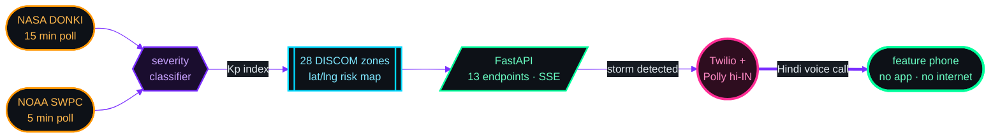
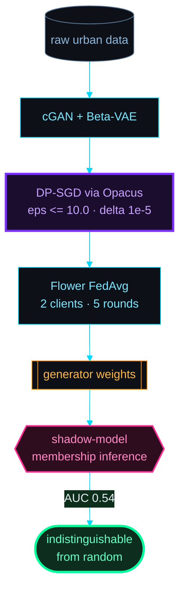
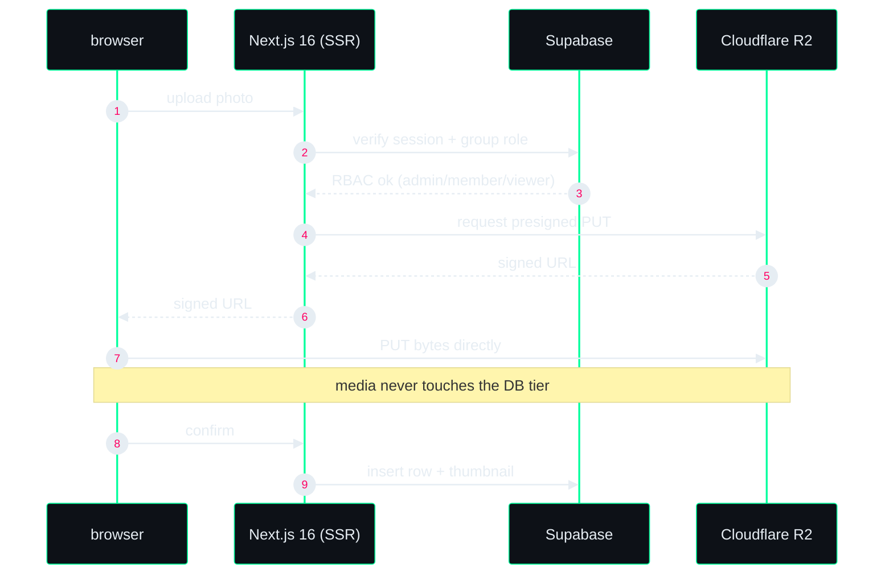
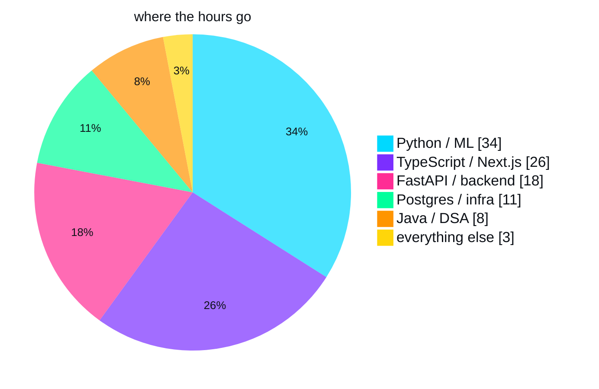
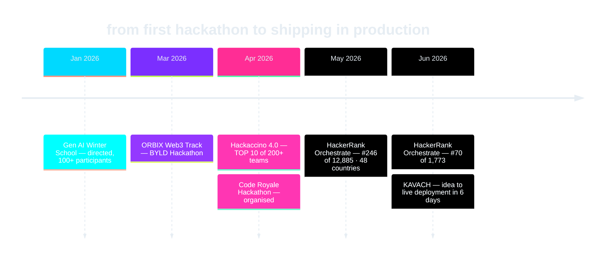

<div align="center">

```
██╗   ██╗██╗██████╗ ██████╗ ██╗  ██╗ ██████╗ ██████╗
██║   ██║██║██╔══██╗██╔══██╗██║  ██║██╔═══██╗██╔══██╗
██║   ██║██║██████╔╝██████╔╝███████║██║   ██║██████╔╝
╚██╗ ██╔╝██║██╔══██╗██╔══██╗██╔══██║██║   ██║██╔══██╗
 ╚████╔╝ ██║██████╔╝██████╔╝██║  ██║╚██████╔╝██║  ██║
  ╚═══╝  ╚═╝╚═════╝ ╚═════╝ ╚═╝  ╚═╝ ╚═════╝ ╚═╝  ╚═╝
                 ██╗ █████╗ ██╗███╗   ██╗
                 ██║██╔══██╗██║████╗  ██║
                 ██║███████║██║██╔██╗ ██║
            ██   ██║██╔══██║██║██║╚██╗██║
            ╚█████╔╝██║  ██║██║██║ ╚████║
             ╚════╝ ╚═╝  ╚═╝╚═╝╚═╝  ╚═══╝
```

`backend` · `applied ML` · `systems for constrained devices`

</div>

```yaml
name:       Vibbhor Jain
role:       Third-year B.Tech, AI & Machine Learning
university: VIPS-TC, GGSIPU — New Delhi
cgpa:       7.8 / 10
shipping:   KAVACH — space weather alerts via Hindi voice calls
status:     open to software / ML engineering internships
```

> **The question isn't whether a model can do something.**
> It's whether the result can reach a person on a 2G connection holding a phone that doesn't run apps.
>
> That's why KAVACH is a phone call and not a dashboard, and why Helix runs entirely in the browser with no server.

---

## KAVACH — the pipeline, live



### the zones it calls — drag to pan, scroll to zoom

```geojson
{
 "type": "FeatureCollection",
 "features": [
  {
   "type": "Feature",
   "properties": {
    "name": "Delhi \u2014 severe risk",
    "marker-color": "#ff2d95",
    "marker-size": "medium",
    "marker-symbol": "triangle"
   },
   "geometry": {
    "type": "Point",
    "coordinates": [
     77.21,
     28.61
    ]
   }
  },
  {
   "type": "Feature",
   "properties": {
    "name": "Jaipur \u2014 high risk",
    "marker-color": "#ff9500",
    "marker-size": "medium",
    "marker-symbol": "triangle"
   },
   "geometry": {
    "type": "Point",
    "coordinates": [
     75.79,
     26.91
    ]
   }
  },
  {
   "type": "Feature",
   "properties": {
    "name": "Lucknow \u2014 high risk",
    "marker-color": "#ff9500",
    "marker-size": "medium",
    "marker-symbol": "triangle"
   },
   "geometry": {
    "type": "Point",
    "coordinates": [
     80.95,
     26.85
    ]
   }
  },
  {
   "type": "Feature",
   "properties": {
    "name": "Patna \u2014 moderate risk",
    "marker-color": "#ffd60a",
    "marker-size": "medium",
    "marker-symbol": "triangle"
   },
   "geometry": {
    "type": "Point",
    "coordinates": [
     85.14,
     25.59
    ]
   }
  },
  {
   "type": "Feature",
   "properties": {
    "name": "Kolkata \u2014 moderate risk",
    "marker-color": "#ffd60a",
    "marker-size": "medium",
    "marker-symbol": "triangle"
   },
   "geometry": {
    "type": "Point",
    "coordinates": [
     88.36,
     22.57
    ]
   }
  },
  {
   "type": "Feature",
   "properties": {
    "name": "Guwahati \u2014 low risk",
    "marker-color": "#00ff9c",
    "marker-size": "medium",
    "marker-symbol": "triangle"
   },
   "geometry": {
    "type": "Point",
    "coordinates": [
     91.74,
     26.14
    ]
   }
  },
  {
   "type": "Feature",
   "properties": {
    "name": "Bhopal \u2014 high risk",
    "marker-color": "#ff9500",
    "marker-size": "medium",
    "marker-symbol": "triangle"
   },
   "geometry": {
    "type": "Point",
    "coordinates": [
     77.41,
     23.26
    ]
   }
  },
  {
   "type": "Feature",
   "properties": {
    "name": "Ahmedabad \u2014 severe risk",
    "marker-color": "#ff2d95",
    "marker-size": "medium",
    "marker-symbol": "triangle"
   },
   "geometry": {
    "type": "Point",
    "coordinates": [
     72.57,
     23.02
    ]
   }
  },
  {
   "type": "Feature",
   "properties": {
    "name": "Mumbai \u2014 moderate risk",
    "marker-color": "#ffd60a",
    "marker-size": "medium",
    "marker-symbol": "triangle"
   },
   "geometry": {
    "type": "Point",
    "coordinates": [
     72.88,
     19.08
    ]
   }
  },
  {
   "type": "Feature",
   "properties": {
    "name": "Hyderabad \u2014 low risk",
    "marker-color": "#00ff9c",
    "marker-size": "medium",
    "marker-symbol": "triangle"
   },
   "geometry": {
    "type": "Point",
    "coordinates": [
     78.49,
     17.39
    ]
   }
  },
  {
   "type": "Feature",
   "properties": {
    "name": "Bengaluru \u2014 low risk",
    "marker-color": "#00ff9c",
    "marker-size": "medium",
    "marker-symbol": "triangle"
   },
   "geometry": {
    "type": "Point",
    "coordinates": [
     77.59,
     12.97
    ]
   }
  },
  {
   "type": "Feature",
   "properties": {
    "name": "Chennai \u2014 low risk",
    "marker-color": "#00ff9c",
    "marker-size": "medium",
    "marker-symbol": "triangle"
   },
   "geometry": {
    "type": "Point",
    "coordinates": [
     80.27,
     13.08
    ]
   }
  }
 ]
}
```

```diff
@@  KAVACH · autonomous space weather shield · LIVE · Team 404_SHINOBI  @@

! May 2024 brought the strongest geomagnetic storm in 20 years.
! India's grid utilities got zero automated warning.

+ Hindi voice calls to feature phones. No app. No internet.
+ 13-endpoint FastAPI backend, SSE streaming, 22.6s full storm replay
+ Backtested on 4 storms (2003-2024): 847 alerts, ~6 hr mean lead time
+ Zero human trigger anywhere in the loop

# FastAPI · APScheduler · Next.js 14 · Supabase · Twilio · Railway
# github.com/VibhorJain1974/kavach-faraway-2026
```

---

## everything else — click to open

<details>
<summary><b>URBAN-GENX</b> — privacy-preserving synthetic city digital twin</summary>



```diff
+ DP-SGD on a cGAN discriminator at eps <= 10.0, delta = 1e-5 (RDP)
+ Shadow-model membership inference run against my own weights
+ Federated: 2 Flower clients, 5 FedAvg rounds, Docker Compose
+ SBERT natural-language interface over 8 urban scene presets

! Most "private" ML claims are never tested. So I attacked my own model.

# PyTorch · Opacus · Flower · UNet cGAN · Beta-VAE · SBERT
# github.com/VibhorJain1974/Urban-GenX
```

</details>

<details>
<summary><b>MEMORIA</b> — full-stack photo platform · <code>LIVE</code></summary>



```diff
+ SSR auth, admin/member/viewer RBAC enforced per group, invite codes
+ Direct-to-R2 presigned uploads — media never touches the DB tier
+ 4-table Postgres schema: photo, video, live-photo, boomerang
+ Scoped, built, debugged and deployed solo, end to end

# Next.js 16 · TypeScript · Supabase · Cloudflare R2 · Tailwind v4
# memoria-gamma-ten.vercel.app
```

</details>

<details>
<summary><b>CROP RADAR</b> — GNN climate risk across 30 Indian zones</summary>

```diff
+ LightGCN implemented in plain PyTorch. No torch_geometric.
+ 5-class risk classification over a 30-zone adjacency graph
+ SHAP KernelExplainer panel, PyDeck risk map, PDF report export
+ Live Open-Meteo + SoilGrids v2 ingestion, offline synthetic fallback

# Python · PyTorch · LightGCN · SHAP · Streamlit · PyDeck
# github.com/VibhorJain1974/crop_radar
```

</details>

<details>
<summary><b>HELIX</b> — offline-first healthcare toolkit</summary>

```diff
! Zero server. Zero install. One URL, then works with the network off.

+ VERA    skin-lesion classification, TF.js + WebGL, 4s inference
+ VERUM   counterfeit-drug detection via CIELab + DCT analysis
+ ASCEND  WebGPU compute shaders + WebRTC mesh
+ pnpm monorepo, all inference on-device — no data leaves the phone

# TypeScript · TensorFlow.js · WebGL · WebGPU · WebRTC · pnpm
# github.com/VibhorJain1974/Helix
```

</details>

---

## stack



```ini
[languages]  Python · TypeScript · JavaScript · Java · SQL · C/C++ · Bash
[backend]    FastAPI · Node.js · REST APIs · SSE · PostgreSQL · Supabase
[frontend]   Next.js · React · Tailwind CSS · Framer Motion · Radix UI
[ml]         PyTorch · Scikit-learn · XGBoost · SHAP · SBERT · TensorFlow.js
[privacy]    Opacus DP-SGD · Flower FedAvg · differential privacy
[infra]      Docker · Vercel · Railway · Cloudflare R2 · Git
```

---

## track record



```diff
@@  competitions  @@

+ #70 / 1,773        HackerRank Orchestrate · June 2026 · Agentic AI Build
+ #246 / 12,885      HackerRank Orchestrate · May 2026 · 48 countries
+ Top 10 / 200+      Hackaccino 4.0 · Bennett University
+ Round 1 MVP        FAR AWAY 2026 (Zuup) · Team 404_SHINOBI

@@  leadership  @@

+ Operations Head    Aarvak Tech Society, VIPS-TC · 2025-present
+                    Gen AI Winter School — 100+ participants
+                    Code Royale Hackathon — tracks, logistics, mentoring
```

---

```console
$ whois vibbhor

  email      jainvibbhor@gmail.com
  linkedin   linkedin.com/in/vibbhor-jain
  github     github.com/VibhorJain1974
  location   Delhi NCR · open to remote

$ _
```
